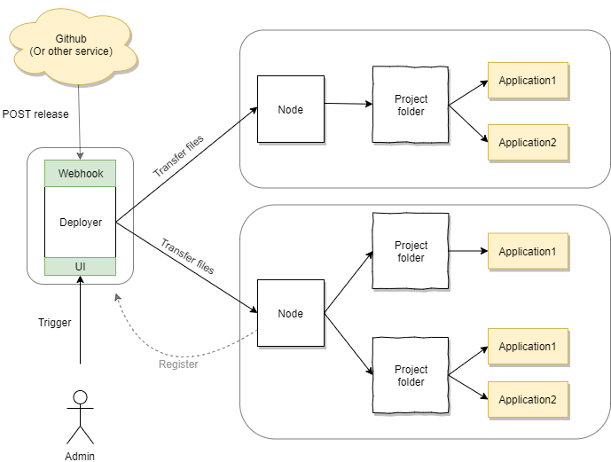

# Deployer [WIP]

Deployer is for building continuous deployment pipeline from eg. github.

Whole Deployer project consists of Deployer (this repository) and nodes.



## Deployer

- Keeps track of different applications, nodes and versions.
- Clones and builds the applications and then sends them securely to the desired nodes for deployment.
- Has webhook that is Github compatible. (You can set webhooks at github.com/user/repository/settings/hooks).
Webhook requests register new applications (if not yet present) and versions to the deployer.
- Can be configured to accept only repositories of certain organization

### Webhook

When deployer receives webhook request for the first time new application is created.

After this build script must be configured manually (for extra security) in the deployer.

On second time and onwards a new folder is created at the deployer server: `deployer/{applicationid}/{buildId}`
Build script is run at the folder. Something like this:
```sh
git clone 
dotnet build
```
Make sure all dependencies etc. required in building the application are installed on deployer server.
Then output in specified output folder is zipped and stored at the deployer server.

## Nodes

- Are setup on servers which contain multiple projects - which in turn contain multiple applications. Each server has one node that receives built files from Deployer.
- Upon initial setup the node registers itself to the deployer.
- When deployment is triggered new releases are uploaded to the registered nodes. Nodes will move downloaded files into their respective project and application folders under configured project root folder.
If not yet present, those folders will be created.

## Security

All communication between Deployer components is secured with HTTPS and [HMAC](https://en.wikipedia.org/wiki/HMAC).

Preferrably Deployer networking should be setup so that:
- Deployer.API receives requests from anywhere (eg. Github or node registrations).
- Deployer.Node:s allowing connections only from Deployer.UI.
- Deployer.UI in intranet, allowing no outside connections.

**I do not take any responsibility, please do your own research before using.**

## Development

Tools:
- Visual Studio
- ReSharper
- Docker (optional, can also just run from vs)
- Database server eg. SQL Server

Configure (appsettings.Development.json) Deployer.UI and Deployer.API to use same database.
Configure database to allow TCP/IP connections to port 1337 (default).

After updating models, run [ef migrations](https://docs.microsoft.com/en-us/ef/core/get-started/overview/first-app?tabs=netcore-cli) with powershell from repository root:
```ps
dotnet ef migrations add InitialCreate --project Deployer.Data
```

## Usage

Webhook (in Deployer.Api) listens to POST events in this route:

`/api/{eventId}`

If using Github you can call these webhooks:

- `/api/push` push event
- `/api/release` release event
- `/api/pull-request` pull request event 

Deployer fetched calling application information from webhook [payload](https://docs.github.com/en/free-pro-team@latest/developers/webhooks-and-events/webhook-events-and-payloads).
